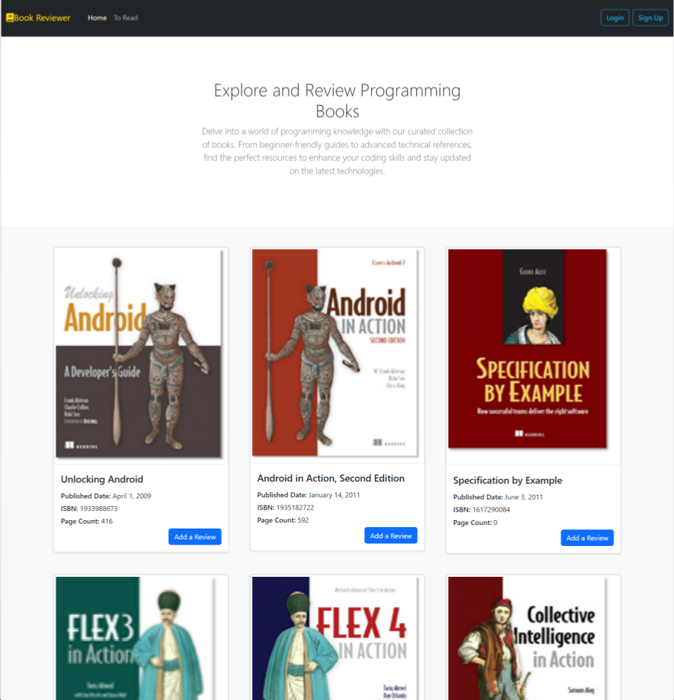
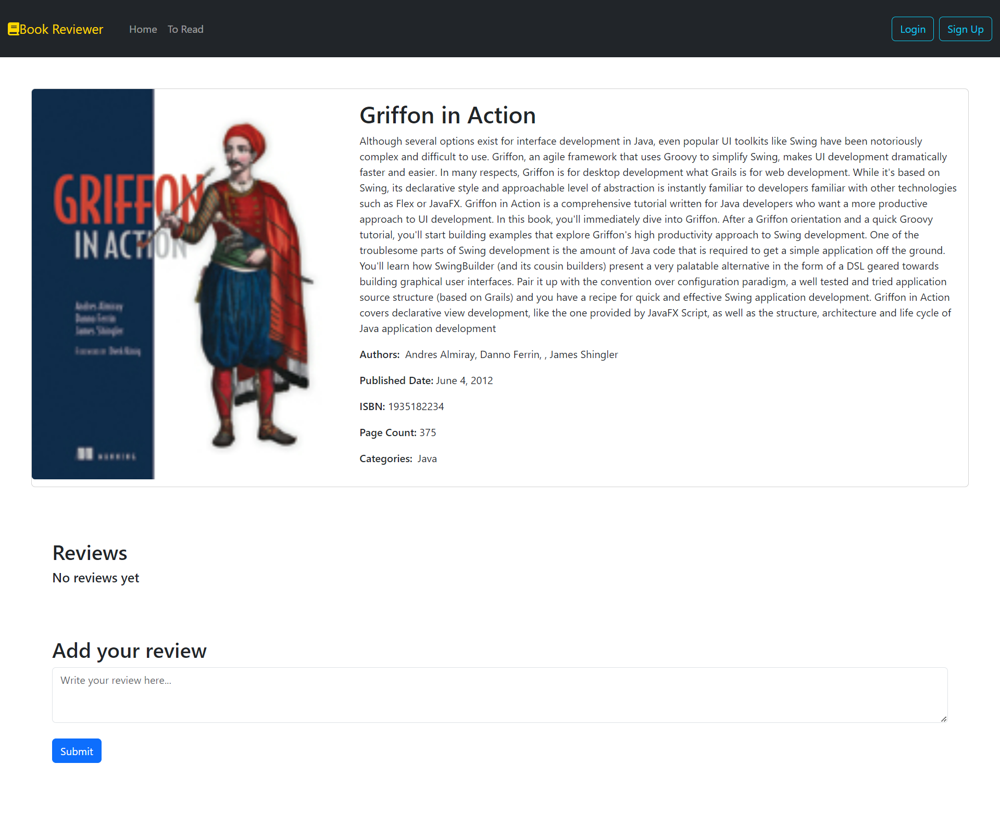

# Book Review System

  
  

#### The Book Reviewer System is a web application designed for users to explore and review a curated collection of programming books. The project was developed to practice and showcase skills in React.js for the frontend and Spring Boot for the backend. The application interacts with the Spring Boot.

### Familiarized myself with

> - React.js features like React Hooks (State/Effect), JSX, components, and props.
> - Spring Boot providing RESTful APIs for book data and reviews retrieval, posting, updating, and deleting reviews.
> - Asynchronous API Calls by using axios library in the frontend to fetch book  and review data from the Spring Boot backend.
> - Bootstrap by styling the user interface for a visually appealing and responsive design using Bootstrap.

### Features
> - Book Display
> - Dynamic Content
> - Review Functionality

### Tech Stack

#### Frontend:
> - React.js
> - CSS/Bootstrap

#### Backend:
> - Spring Boot (Java)
